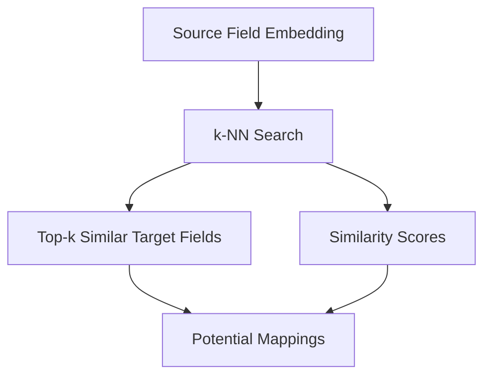
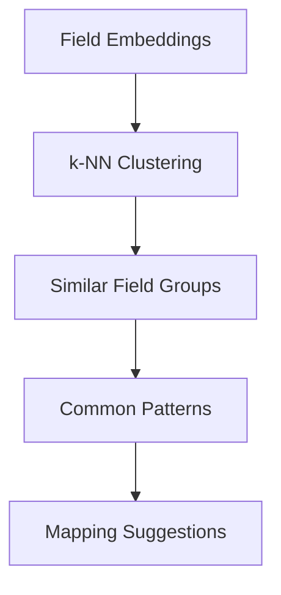
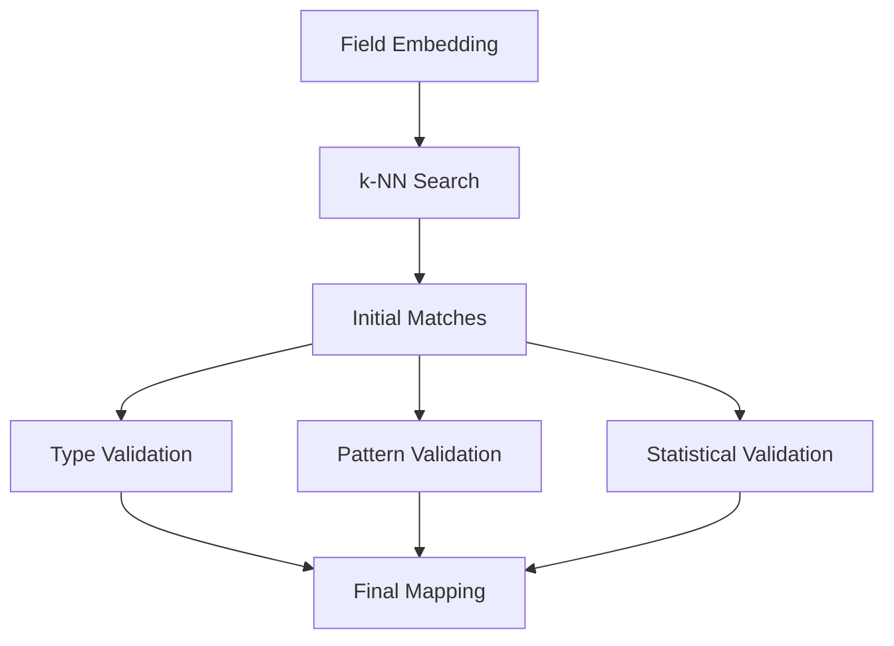

# Healthcare Schema Mapping with Embeddings

This project implements an automated schema mapping solution for healthcare data, specifically focusing on medical provider information across multiple SQL sources to a target SQL database. It uses embedding models to automatically map schemas, addressing the challenge of frequently changing source schemas.

## 🚀 Features

### Core Functionality

- **Automated schema mapping** using embedding models
- **Support for multiple SQL source databases**
- **Handling of dynamic schema changes**
- **Healthcare-specific data handling**
- **Similarity-based field mapping**

### Advanced Features

- **Multi-layer caching system** (Memory, Redis, Blob Storage)
- **Comprehensive data profiling** with pre and post-mapping analysis
- **Performance optimizations** (GPU support, batch processing)
- **Cloud deployment support** (Azure, AWS, GCP)
- **Real-time schema change detection**
- **Mapping quality assessment and validation**

### Data Profiling

- **Independent source/target profiling** before mapping
- **Pre-mapping analysis** with potential field matches
- **Post-mapping comparison** with compatibility scores
- **Data quality assessment** and readiness scoring
- **Schema pattern detection** and categorization

### Caching Strategies

- **Internal memory cache** for fastest access
- **Redis cache** for shared state across instances
- **Blob storage** for persistent large data
- **Vector database** for similarity search
- **Hybrid caching** for optimal performance

## 📁 Project Structure

```
embedding_schemaMap/
├── src/
│   ├── data/                    # Mock data generation
│   │   └── mock_data_generator.py
│   ├── embeddings/              # Embedding model handling
│   │   └── embedding_handler.py
│   ├── schema_mapping/          # Core mapping logic
│   │   └── schema_mapper.py
│   ├── db/                     # Database connections
│   │   └── db_handler.py
│   └── utils/                  # Utility functions
│       ├── data_profiler.py    # Enhanced data profiling
│       ├── memory_cache.py     # In-memory caching
│       └── cloud_cache.py      # Cloud cache handlers
├── tests/                      # Test cases
│   └── test_data_profiler.py
├── config/                     # Configuration files
│   └── db_config.yaml
├── examples/                   # Usage examples
│   └── usage_example.py
└── data/                       # Generated data and reports
    ├── profiles/               # Data profiling reports
    ├── cache/                  # Cache files
    └── embedding_cache/        # Embedding cache
```

## 🛠️ Setup

### 1. Create Virtual Environment

```bash
python -m venv venv
source venv/bin/activate  # On Windows: venv\Scripts\activate
```

### 2. Install Dependencies

```bash
pip install -r requirements.txt
```

### 3. Configure Database Connections

Edit `config/db_config.yaml` to set up your database connections:

```yaml
databases:
  source1:
    connection_string: "your_source1_connection_string"
    table_name: "your_source1_table"

  source2:
    connection_string: "your_source2_connection_string"
    table_name: "your_source2_table"

  target:
    connection_string: "your_target_connection_string"
    table_name: "your_target_table"
```

### 4. Configure Cloud Cache (Optional)

For cloud deployment, configure cache settings:

```yaml
cloud_cache:
  redis_url: "redis://your-redis-endpoint:6379"
  blob_storage_url: "https://your-storage-account.blob.core.windows.net"
  cosmos_endpoint: "https://your-cosmos-account.documents.azure.com:443/"
```

## 🚀 Usage

### Basic Usage

```bash
python src/main.py
```

### Run Example

```bash
python examples/usage_example.py
```

### Run Tests

```bash
pytest tests/
```

## 📊 Complete Data Profiling Workflow

The system implements a comprehensive 3-phase data profiling workflow:

### **Phase 1: Pre-Mapping Analysis**

Independent profiling of sources and targets before mapping:

```python
from src.utils.data_profiler import EnhancedDataProfiler

profiler = EnhancedDataProfiler(db_handler, embedding_handler)

# Profile sources independently
source1_profile = profiler.profile_source_independently('source1', 'table_name')
source2_profile = profiler.profile_source_independently('source2', 'table_name')
target_profile = profiler.profile_target_independently('target', 'table_name')

# Analyze potential mappings
pre_mapping_analysis = profiler.analyze_potential_mappings(source1_profile, target_profile)

# Assess mapping readiness
readiness = profiler.assess_mapping_readiness(source1_profile, target_profile)
```

**Pre-Mapping Metrics:**

- **Schema Metrics**: Column count, field types, naming conventions
- **Data Quality**: Null ratio, data completeness, unique ratio
- **Field Patterns**: Field categories, naming patterns
- **Similarity Scores**: Semantic, type, and pattern similarity
- **Readiness Score**: Overall mapping readiness assessment

### **Phase 2: Mapping Execution**

Performance-optimized mapping with caching:

```python
from src.utils.memory_cache import SchemaMappingWithInternalMemory

cache = SchemaMappingWithInternalMemory()
mapping = cache.map_schema(source_schema, target_schema, embedding_handler)

# Transform data
transformed_data = schema_mapper.transform_data(source_data, mapping)
```

**Mapping Metrics:**

- **Mapping Quality**: Coverage, confidence scores, high/low confidence mappings
- **Performance**: Mapping time, cache hit rate, embedding generation time
- **Cache Performance**: Memory, Redis, and Blob storage statistics

### **Phase 3: Post-Mapping Comparison**

Detailed comparison and compatibility assessment:

```python
from src.utils.data_profiler import PostMappingProfiler

post_profiler = PostMappingProfiler(db_handler, schema_mapper)
comparison = post_profiler.create_mapping_aware_comparison(
    source_profile, target_profile, mapping
)
```

**Post-Mapping Metrics:**

- **Mapping Results**: Mapped fields, unmapped fields, success rate
- **Compatibility**: Type, range, and distribution compatibility
- **Data Quality**: Source/target quality, quality improvement
- **Transformation**: Required transformations, complexity, data loss risk

## 📈 Key Performance Indicators (KPIs)

| **KPI Category**  | **Metric**                | **Target** | **Description**                          |
| ----------------- | ------------------------- | ---------- | ---------------------------------------- |
| **Quality**       | Mapping Success Rate      | > 80%      | Percentage of fields successfully mapped |
|                   | Average Confidence        | > 0.8      | Mean confidence score of mappings        |
|                   | Data Quality Score        | > 0.9      | Overall data quality assessment          |
| **Performance**   | Mapping Time              | < 5s       | Time to complete mapping                 |
|                   | Cache Hit Rate            | > 70%      | Percentage of cache hits                 |
|                   | Memory Usage              | < 1GB      | Memory consumption                       |
| **Compatibility** | Type Compatibility        | > 85%      | Compatible field types                   |
|                   | Overall Compatibility     | > 80%      | Weighted compatibility score             |
| **Efficiency**    | Unmapped Fields           | < 20%      | Percentage of unmapped fields            |
|                   | Transformation Complexity | LOW        | Complexity of required transformations   |

## 💾 Caching Strategies

### Internal Memory Cache

```python
from src.utils.memory_cache import SchemaMappingWithInternalMemory

cache = SchemaMappingWithInternalMemory()
mapping = cache.map_schema(source_schema, target_schema, embedding_handler)
```

### Cloud Cache (Azure Example)

```python
from src.utils.cloud_cache import HybridCloudCacheHandler

cloud_cache = HybridCloudCacheHandler(
    redis_url="redis://your-redis-endpoint:6379",
    blob_storage_url="https://your-storage-account.blob.core.windows.net",
    cosmos_endpoint="https://your-cosmos-account.documents.azure.com:443/"
)

# Multi-layer cache access
embedding = cloud_cache.get_embedding("field_name")
cloud_cache.set_embedding("field_name", embedding)
```

## 🔧 Configuration Options

### Performance Settings

```yaml
performance:
  memory_cache_max_size: 10000
  memory_cache_ttl: 7200 # 2 hours
  batch_size: 32
  use_gpu: true
  gpu_memory_fraction: 0.8
```

### Profiling Settings

```yaml
profiling:
  sample_size: 1000
  export_profiles: true
  enable_pre_mapping_analysis: true
  enable_post_mapping_comparison: true
```

### Monitoring Settings

```yaml
monitoring:
  enable_logging: true
  log_level: "INFO"
  export_metrics: true
  metrics_file: "data/metrics.json"
```

## 📈 Performance Optimizations

### 1. GPU Acceleration

- Automatic GPU detection and utilization
- Batch processing for efficient GPU usage
- Memory optimization for large datasets

### 2. Caching Layers

- **Memory Cache**: Fastest access for frequently used data
- **Redis Cache**: Shared state across multiple instances
- **Blob Storage**: Persistent storage for large embeddings
- **Vector Database**: Similarity search capabilities

### 3. Batch Processing

- Configurable batch sizes for embedding generation
- Matrix operations for similarity computation
- Parallel processing for multiple schemas

## 🌐 Cloud Deployment

### Azure Deployment

```python
# Azure Cache for Redis
redis_handler = AzureRedisCacheHandler(redis_connection_string)

# Azure Blob Storage
blob_handler = AzureBlobCacheHandler(storage_account_url, container_name)

# Azure Cosmos DB
cosmos_handler = AzureCosmosCacheHandler(cosmos_endpoint, database_name, container_name)
```

### AWS Deployment

```python
# AWS ElastiCache + S3
aws_cache = AWSCloudCacheHandler(
    redis_endpoint="your-elasticache-endpoint",
    s3_bucket="your-s3-bucket"
)
```

### GCP Deployment

```python
# GCP Memorystore + Cloud Storage
gcp_cache = GCPCloudCacheHandler(
    redis_endpoint="your-memorystore-endpoint",
    storage_bucket="your-storage-bucket"
)
```

## 📊 Output and Reports

### Generated Files

- `data/profiles/`: Data profiling reports
- `data/cache/`: Cache files
- `data/embedding_cache/`: Embedding cache
- `data/mapping_history.json`: Mapping history
- `data/comprehensive_mapping_report.json`: Complete analysis

### Report Structure

```json
{
  "source1": {
    "profile": {
      "schema": {"column_count": 6, "columns": {...}},
      "statistics": {"row_count": 1000, "columns": {...}},
      "data_quality": {"null_ratio": 0.05, "completeness": 0.95},
      "patterns": {"naming_conventions": {...}, "field_categories": {...}}
    },
    "mapping": {
      "provider_id": {
        "target_field": "healthcare_provider_id",
        "confidence": 0.95,
        "explanation": "Mapped with high confidence"
      }
    },
    "comparison": {
      "mapped_fields": {...},
      "unmapped_source_fields": [...],
      "unmapped_target_fields": [...],
      "compatibility_score": 0.92
    }
  },
  "pre_mapping_analysis": {
    "potential_mappings": {...},
    "field_similarities": {...},
    "mapping_readiness": {"overall_score": 0.85}
  },
  "mapping_metrics": {
    "quality": {"mapping_coverage": 0.83, "average_confidence": 0.87},
    "performance": {"mapping_time_ms": 1250, "cache_hit_rate": 0.75},
    "cache_statistics": {...}
  },
  "final_metrics": {
    "mapping_success_rate": 0.83,
    "overall_compatibility": 0.82,
    "data_quality_improvement": 0.05
  }
}
```

## 🧪 Testing

### Run All Tests

```bash
pytest tests/
```

### Run Specific Tests

```bash
pytest tests/test_data_profiler.py -v
```

### Test Coverage

```bash
pytest --cov=src tests/
```

## 🔍 Monitoring and Debugging

### Logging

The system provides comprehensive logging:

- Cache hit/miss rates
- Mapping confidence scores
- Performance metrics
- Error tracking

### Metrics

- Embedding generation time
- Cache performance statistics
- Mapping accuracy metrics
- Data quality scores

### Comprehensive Metrics Dashboard

```python
def generate_comprehensive_metrics_report(pre_analysis, mapping_results, post_analysis):
    """Generate comprehensive metrics report"""

    return {
        "summary": {
            "total_source_fields": len(pre_analysis["source_profile"]["schema"]["columns"]),
            "total_target_fields": len(pre_analysis["target_profile"]["schema"]["columns"]),
            "successfully_mapped": len(mapping_results["mapping"]),
            "mapping_success_rate": len(mapping_results["mapping"]) / len(pre_analysis["source_profile"]["schema"]["columns"]),
            "average_confidence": sum(info["confidence"] for info in mapping_results["mapping"].values()) / len(mapping_results["mapping"])
        },
        "pre_mapping_metrics": {
            "data_quality_score": pre_analysis["source_profile"]["data_quality"]["data_completeness"],
            "schema_complexity": len(pre_analysis["source_profile"]["schema"]["columns"]),
            "mapping_readiness": pre_analysis["mapping_readiness"]["overall_score"],
            "potential_mappings_identified": len(pre_analysis["potential_mappings"])
        },
        "mapping_metrics": {
            "mapping_time_ms": mapping_results["mapping_metrics"]["performance"]["mapping_time_ms"],
            "cache_hit_rate": mapping_results["mapping_metrics"]["performance"]["cache_hit_rate"],
            "embedding_generation_time_ms": mapping_results["mapping_metrics"]["performance"]["embedding_generation_time_ms"]
        },
        "post_mapping_metrics": {
            "compatibility_score": post_analysis["final_metrics"]["overall_compatibility"],
            "unmapped_source_fields": len(post_analysis["comparison"]["unmapped_source_fields"]),
            "unmapped_target_fields": len(post_analysis["comparison"]["unmapped_target_fields"]),
            "transformation_complexity": post_analysis["final_metrics"]["transformation_complexity"]
        },
        "performance_metrics": {
            "total_processing_time_ms": (
                mapping_results["mapping_metrics"]["performance"]["mapping_time_ms"] +
                mapping_results["mapping_metrics"]["performance"]["embedding_generation_time_ms"]
            ),
            "cache_efficiency": mapping_results["mapping_metrics"]["performance"]["cache_hit_rate"],
            "memory_usage_mb": mapping_results["mapping_metrics"]["cache_statistics"]["memory_cache"].get("memory_usage_mb", 0)
        }
    }
```

## 🤝 Contributing

1. Fork the repository
2. Create a feature branch
3. Make your changes
4. Add tests
5. Submit a pull request

## 📝 License

This project is licensed under the MIT License - see the LICENSE file for details.

## 🆘 Support

For questions and support:

1. Check the documentation
2. Review the examples
3. Open an issue on GitHub

## 🔄 Version History

- **v2.0**: Added comprehensive data profiling, multi-layer caching, cloud support
- **v1.0**: Basic schema mapping with embeddings

## 📊 Complete Workflow Example

```python
def complete_data_profiling_workflow():
    """Complete data profiling workflow with all phases"""

    print("🔄 Starting Complete Data Profiling Workflow")
    print("=" * 60)

    # Phase 1: Pre-Mapping Analysis
    print("\n📋 Phase 1: Pre-Mapping Analysis")
    print("-" * 40)

    pre_analysis = pre_mapping_analysis('source1', 'target')

    print(f"✅ Source fields: {len(pre_analysis['source_profile']['schema']['columns'])}")
    print(f"✅ Target fields: {len(pre_analysis['target_profile']['schema']['columns'])}")
    print(f"✅ Mapping readiness: {pre_analysis['mapping_readiness']['overall_score']:.2f}")
    print(f"✅ Potential mappings: {len(pre_analysis['potential_mappings'])}")

    # Phase 2: Mapping Execution
    print("\n🎯 Phase 2: Mapping Execution")
    print("-" * 40)

    mapping_results = execute_mapping(
        pre_analysis['source_profile']['schema']['columns'],
        pre_analysis['target_profile']['schema']['columns']
    )

    print(f"✅ Mapped fields: {len(mapping_results['mapping'])}")
    print(f"✅ Average confidence: {mapping_results['mapping_metrics']['quality']['average_confidence']:.2f}")
    print(f"✅ Mapping time: {mapping_results['mapping_metrics']['performance']['mapping_time_ms']}ms")

    # Phase 3: Post-Mapping Analysis
    print("\n📊 Phase 3: Post-Mapping Analysis")
    print("-" * 40)

    post_analysis = post_mapping_analysis(
        pre_analysis['source_profile'],
        pre_analysis['target_profile'],
        mapping_results['mapping']
    )

    print(f"✅ Mapping success rate: {post_analysis['final_metrics']['mapping_success_rate']:.2f}")
    print(f"✅ Overall compatibility: {post_analysis['final_metrics']['overall_compatibility']:.2f}")
    print(f"✅ Unmapped source fields: {len(post_analysis['comparison']['unmapped_source_fields'])}")

    # Generate comprehensive report
    comprehensive_report = generate_comprehensive_metrics_report(
        pre_analysis, mapping_results, post_analysis
    )

    print("\n📈 Comprehensive Metrics Summary")
    print("-" * 40)
    print(f"📊 Mapping Success Rate: {comprehensive_report['summary']['mapping_success_rate']:.1%}")
    print(f"📊 Average Confidence: {comprehensive_report['summary']['average_confidence']:.2f}")
    print(f"📊 Overall Compatibility: {comprehensive_report['post_mapping_metrics']['compatibility_score']:.2f}")
    print(f"📊 Total Processing Time: {comprehensive_report['performance_metrics']['total_processing_time_ms']}ms")
    print(f"📊 Cache Hit Rate: {comprehensive_report['mapping_metrics']['cache_hit_rate']:.1%}")

    return comprehensive_report
```

This comprehensive system provides end-to-end schema mapping with full visibility into data quality, performance, and mapping accuracy.

## **🎯 k-NN in Schema Mapping**

### **1. Primary Use Cases**

#### A. **Finding Similar Fields**



- Takes a source field embedding as query
- Finds k closest target field embeddings
- Returns top-k most similar fields
- Example: k=3 returns 3 most similar target fields

#### B. **Schema Pattern Discovery**



- Groups similar fields across schemas
- Identifies common patterns
- Helps with complex mappings

### **2. How k-NN Works in Schema Mapping**

#### Example Scenario:

```
Source Field: "provider_id"
k = 3 (find 3 nearest neighbors)

Target Fields:
1. "healthcare_provider_id" (distance: 0.1)
2. "doctor_id" (distance: 0.3)
3. "provider_number" (distance: 0.4)
4. "patient_id" (distance: 0.7)
5. "appointment_id" (distance: 0.8)

k-NN Result (k=3):
1. healthcare_provider_id (closest)
2. doctor_id (second closest)
3. provider_number (third closest)
```

### **3. k-NN Applications**

#### A. **Direct Field Matching**

```
Query: provider_id
k=3 Returns:
1. healthcare_provider_id (95% similar)
2. doctor_id (85% similar)
3. provider_number (80% similar)
```

#### B. **Pattern-Based Matching**

```
Pattern Group Example (k=4):
- provider_id
- doctor_id
- nurse_id
- staff_id
→ Identifies "identifier" pattern
```

#### C. **Complex Field Relationships**

```
Multiple Related Fields (k=3):
provider_id →
  1. healthcare_provider_id
  2. provider_license_number
  3. provider_registration
→ Suggests compound mapping
```

### **4. Benefits of k-NN in Schema Mapping**

1. **Fuzzy Matching**

   - Not just exact matches
   - Handles variations in naming
   - Considers semantic similarity

2. **Confidence Levels**

   - Distance indicates match quality
   - Multiple candidates with scores
   - Better decision making

3. **Pattern Discovery**
   - Groups similar fields
   - Identifies field relationships
   - Suggests complex mappings

### **5. k-NN Parameters**

#### A. **Choosing k Value**

```
Small k (1-3):
- More precise matches
- Less noise
- Good for direct mappings

Larger k (5-10):
- More pattern discovery
- Better for complex relationships
- Good for exploration
```

#### B. **Distance Metrics**

```
Cosine Similarity:
- Good for embeddings
- Scale-independent
- Common in text/field matching

Euclidean Distance:
- Good for numeric features
- Scale-dependent
- Used with normalized data
```

### **6. Practical Example**

```
Source Schema Fields:
- provider_id
- provider_name
- license_number

k-NN Process (k=2):
1. provider_id →
   - healthcare_provider_id (0.95)
   - doctor_id (0.85)

2. provider_name →
   - doctor_name (0.92)
   - physician_name (0.90)

3. license_number →
   - medical_license (0.88)
   - provider_license (0.85)
```

### **7. Advanced k-NN Usage**

#### A. **Hierarchical Matching**

```
Level 1 (k=2):
provider_details →
  - doctor_information
  - physician_data

Level 2 (k=2 for each subfield):
  provider_details.name →
    - doctor_information.full_name
    - physician_data.name
```

#### B. **Context-Aware k-NN**

```
Context: Medical Provider
Field: id

k-NN with Context:
1. healthcare_provider_id (0.95)
2. medical_license_number (0.85)
3. physician_id (0.80)

vs.

Context: Patient
Field: id
1. patient_id (0.95)
2. medical_record_number (0.85)
3. patient_registration (0.80)
```

### **8. Integration with Other Techniques**



k-NN is particularly useful in schema mapping because it:

1. **Handles Uncertainty**: Provides multiple potential matches
2. **Discovers Patterns**: Groups similar fields together
3. **Supports Exploration**: Helps find non-obvious matches
4. **Scales Well**: Efficient with large schemas
5. **Provides Context**: Distance metrics give confidence levels

The key is using k-NN as part of a larger strategy, combining it with:

- Embedding models for semantic understanding
- Type checking for validation
- Pattern matching for confirmation
- Statistical analysis for verification

This creates a robust, multi-faceted approach to schema mapping that can handle complex, real-world scenarios.
